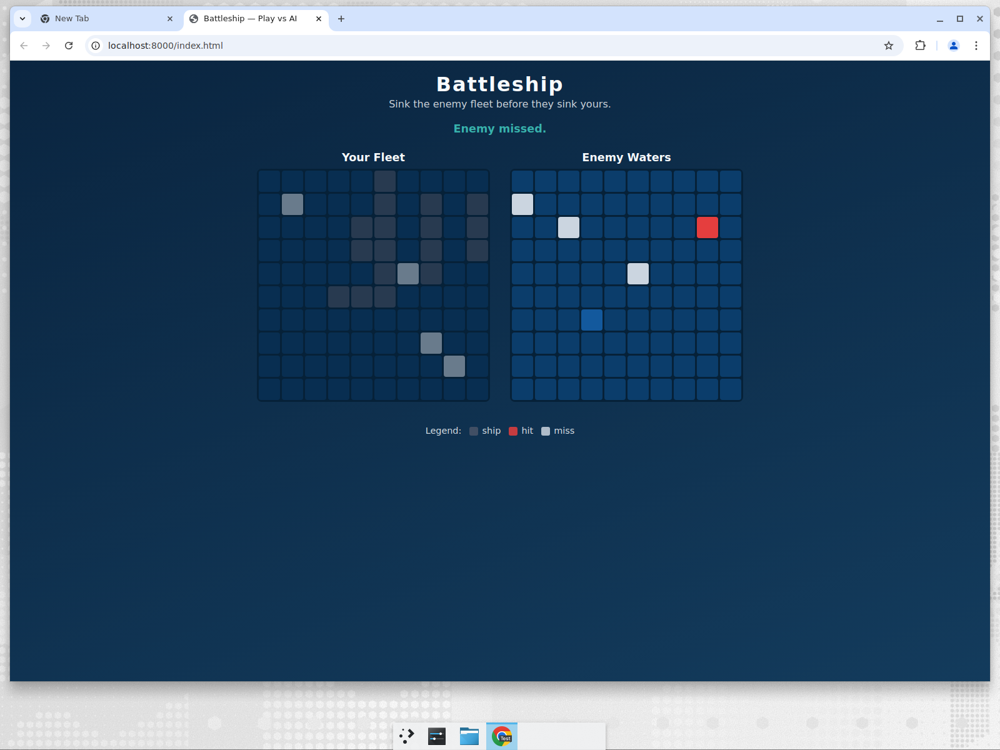

# Battleship vs AI

A simple, dependency-free **Battleship** game you play in the browser against
an AI opponent. Place your fleet, then take turns firing until one fleet is
sunk.

**Play it here:** _(link added after deployment)_



## Features

- Classic 10×10 Battleship with the standard fleet (Carrier 5, Battleship 4,
  Cruiser 3, Submarine 3, Destroyer 2).
- Manual ship placement with a **Rotate** toggle, plus one-click **Random**
  placement.
- Turn-based combat with clear hit / miss / sunk feedback and a win/lose state.
- An AI that uses a **hunt / target** strategy (see below) — noticeably smarter
  than random firing.
- Illegal moves are prevented (overlaps, off-board placement, firing twice at
  the same cell, firing before setup is complete).
- Responsive layout that works on desktop and mobile.

## How the AI works

The AI lives in [`src/ai.js`](src/ai.js) and has two modes:

- **Hunt:** when it has no leads, it fires at cells on a checkerboard parity
  pattern. Because the smallest ship is length 2, every ship must touch at
  least one parity cell, so this finds ships in roughly half the shots a fully
  random search would need.
- **Target:** after a hit, it queues the four orthogonally adjacent cells and
  focuses fire on them to finish off the ship. Once a ship is sunk it drops its
  leads and goes back to hunting.

## Project structure

```
index.html      # markup + grid containers
styles.css      # styling
src/logic.js    # pure game logic (Board, Ship, fleet, placement, firing) — no DOM
src/ai.js       # hunt/target AI opponent — no DOM
src/ui.js       # DOM controller wiring logic + AI to the page
tests/test.js   # Node test harness for the pure logic
BUGS.md         # bugs found during development and how they were fixed
```

Game logic is intentionally kept free of any DOM access so it can be unit
tested directly in Node.

## Run locally

No build step or dependencies required — it's plain HTML/CSS/JS (ES modules).
Because it uses ES modules, serve it over HTTP rather than opening the file
directly:

```bash
# from the repo root
python3 -m http.server 8000
# then open http://localhost:8000
```

## Tests

```bash
npm test        # runs node tests/test.js
```

The suite runs ~39,400 assertions: placement validation, firing mechanics, 200
randomized fleet layouts (no overlaps, correct sizes), 300 full simulated games
(all terminate with a correct winner), and a check that the AI can sink a full
fleet within 100 shots.

## License

MIT
